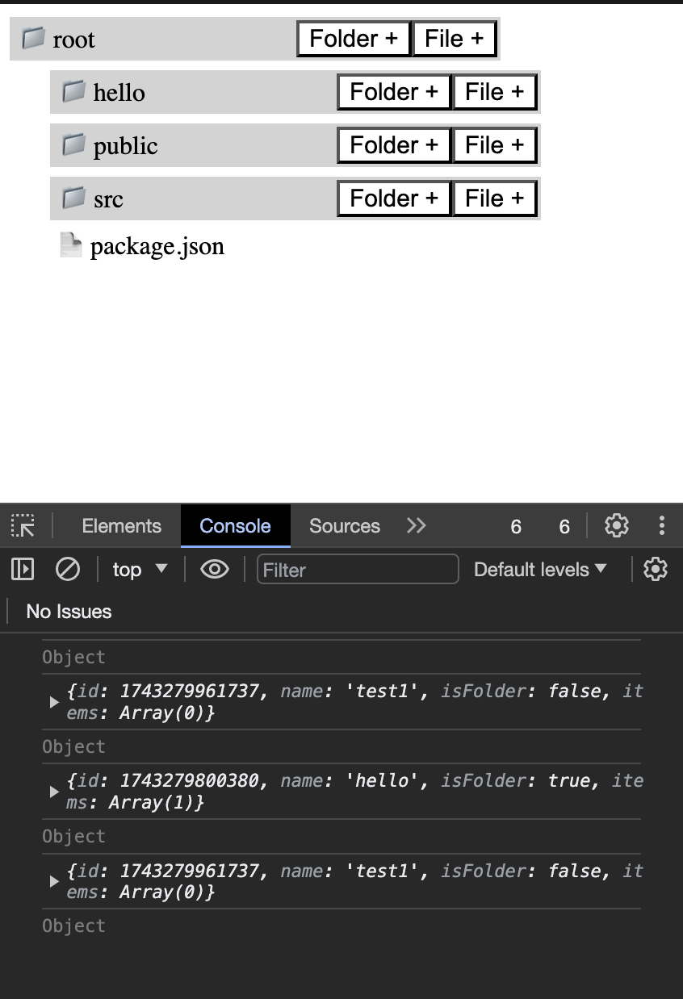
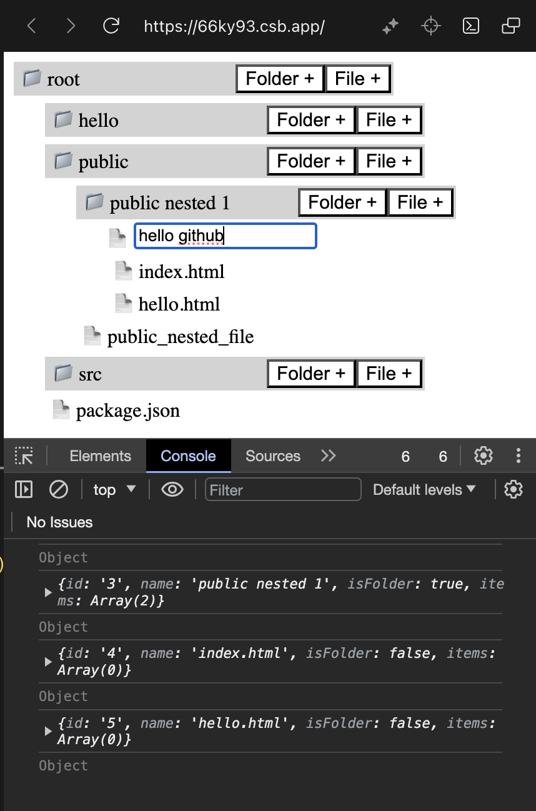
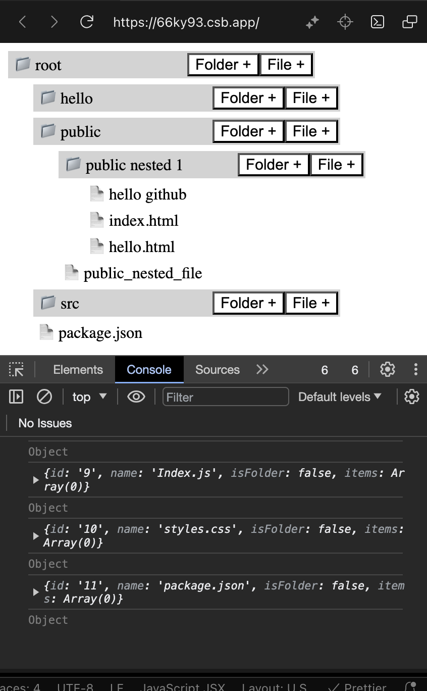

# recursiveFileExplorer
Recursive File Explorer - reactjs project that uses the tree data structure. 

## Screenshots- 
### 1. Initial Directory Structure:   

### 2. Add a file:   

### 3. Final Structure   

